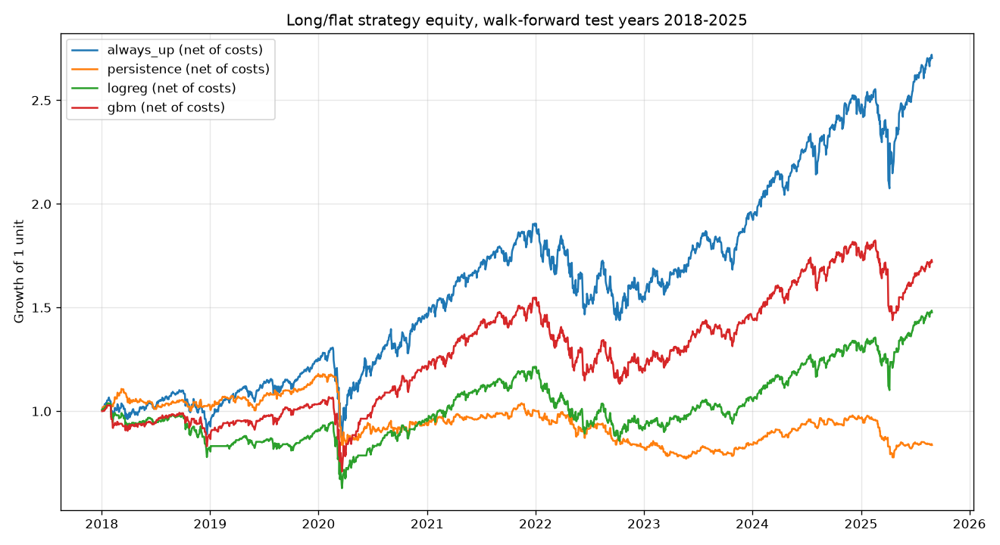

# Market Predictor

End-to-end pipeline that predicts next-day direction of a market index from historical daily OHLCV data.
Built for an ML Engineer take-home assessment. The goal is a leakage-free, honestly validated pipeline, not a system that beats the market.

## 1. Problem Framing

### Why daily direction prediction is nearly impossible

Under the weak form of the Efficient Market Hypothesis, all information contained in past prices and volume is already reflected in the current price. Every feature in this project is derived from past prices and volume, so the theory predicts that the feature set carries close to zero information about tomorrow's move. Any edge that survives comes from small, short-lived inefficiencies such as short-horizon momentum or mean reversion, and those effects are weak.

The noise-to-signal ratio makes this worse. SPY's average daily return is roughly 0.04%, while its daily standard deviation is roughly 1%. The signal is about 25 times smaller than the noise around it, so a model that fits the training data closely is mostly memorizing noise.

Finally, the series is non-stationary. The relationship between features and target changes across regimes: the 2020 crash, the 2021 melt-up, the 2022 rate-hike bear market. A model trained on one regime is evaluated in another. This is why validation must respect time order and why random k-fold is invalid here.

### Why classification rather than regression

The task is framed as binary classification of next-day direction. The downstream decision is binary (hold the index tomorrow or stay flat), and the assessment evaluates directional accuracy. Regression on daily returns collapses toward predicting the mean, roughly zero, which is statistically indistinguishable from a model that always outputs zero and gives no usable decision.

### Target contract

At the close of trading day t, using only information available at or before close[t], predict whether close[t+1] > close[t].

Every feature for row t must be computable from data with index <= t. The label for row t is derived from index t+1. Any feature that violates this is lookahead leakage, and any statistic fitted on the full dataset (for example a global scaler) is leakage for the same reason: it lets early rows see later data.

### Baseline

Markets drift upward, so roughly 53% of SPY trading days close higher than the previous day. The baseline to beat is therefore the class prior ("always predict up", ~53%), not a coin flip at 50%. A model that does not beat the class prior on a time-ordered test set has learned nothing. Consistent with the assessment's guidance, any result above ~60% is treated as a leakage bug until proven otherwise.

## 2. Data

**Instrument:** SPY (SPDR S&P 500 ETF), used as a liquid, tradeable proxy for the S&P 500.

**Source:** Yahoo Finance via the `yfinance` Python package. Free, no API key.

**Range:** 2015-01-01 to 2025-08-31 (frozen; yfinance treats the end date as exclusive, so the last row is 2025-08-29). 2,681 trading-day rows, 6 columns: Open, High, Low, Close, Adj Close, Volume. Zero missing values.

**Re-fetch:**
```
python scripts/fetch_data.py
```
Writes `data/spy_raw.csv`. Every downstream stage reads this file; nothing else touches the network.

**Why the end date is frozen and the CSV is cached.** Yahoo back-adjusts historical prices every time a new dividend is paid and occasionally backfills corrections, so two live fetches a week apart can differ. Freezing the range and caching the raw file makes every later result reproducible.

**Adjusted vs raw close.** All features and the target are computed from `Adj Close`. Raw `Close` contains a discontinuity on each of the 42 quarterly dividend dates in this range (the price drops by the dividend amount while nothing economic changed). `Adj Close` back-scales pre-dividend prices to remove those discontinuities, so returns reflect real market movement. The cumulative effect is large: the two columns differ by 17.4% at the start of 2015 and 1.1% at the end of the range. Example on the 2015-03-20 dividend date: raw return +0.43%, adjusted return +0.88%.

`yfinance` was called with `auto_adjust=False` so both columns are kept on disk. This makes the adjustment visible and verifiable rather than silently applied.

**Calendar.** The index contains trading days only (weekends and exchange holidays are absent), roughly 252 rows per year. All rolling windows in this project are therefore in trading days: 5 = one week, 20 = one month, 252 = one year.

## 3. Features

All features are computed in `src/features.py` from `Adj Close`, `Volume`, and same-day `High`/`Low`/`Close`. Every feature is scale-free (a return, a ratio, or a z-score) so that its meaning is the same at a price of 200 as at 640.

| Feature | Definition | Captures |
|---|---|---|
| `ret_1` | 1-day return | Yesterday's move |
| `ret_5` | 5-day return | One-week momentum |
| `ret_20` | 20-day return | One-month momentum |
| `vol_20` | 20-day rolling std of `ret_1` | Recent realised volatility |
| `sma_ratio_20` | price / 20-day SMA − 1 | Distance from short-term trend |
| `sma_ratio_50` | price / 50-day SMA − 1 | Distance from medium-term trend |
| `rsi_14` | 14-day RSI (simple-mean variant), 0–100 | Overbought / oversold |
| `macd` | (EMA12 − EMA26) / price | Trend acceleration, normalised |
| `vol_z_20` | (volume − 20-day mean) / 20-day std | Unusual volume |
| `range_pct` | (high − low) / close | Intraday range |

**Leakage discipline.** Every feature on row *t* uses only rows ≤ *t*. Pandas `rolling`, `ewm`, `pct_change`, and `diff` are backward-looking; no centered windows and no whole-column statistics are used. The single forward-looking operation in the pipeline is `shift(-1)` inside `add_target()`, which builds `next_ret` (tomorrow's return) and `target = next_ret > 0`. Rows without enough history (first 50) and the final row (no tomorrow) are dropped rather than filled.

**Sanity checks on the output** (2,631 rows, 2015-03-16 to 2025-08-28):
- No NaN or infinite values; RSI within [4.0, 96.7].
- Target alignment verified by hand against the raw file on the final rows.
- Every feature's correlation with the target is below 0.04 in absolute value. A strong correlation here would be the first sign of leakage.
- Class prior (share of up days): 54.8%. Persistence baseline (yesterday's direction repeats): 49.0%, below a coin flip, reflecting mild daily mean reversion in SPY.

## 4. Models

Two baselines and two models, all evaluated identically.

| Name | What it does | Why it is here |
|---|---|---|
| `always_up` | Predicts 1 every day | The class prior. The real floor to beat, not 50%. |
| `persistence` | Predicts yesterday's direction repeats | Tests whether momentum exists at a 1-day horizon |
| `logreg` | Logistic regression on 10 standardised features | Honest, linear, interpretable; cannot memorise noise |
| `gbm` | Gradient boosting, 100 trees, depth 2, learning rate 0.05 | Captures non-linear interactions; kept shallow and slow to limit overfitting on noisy data |

Deep learning was rejected: 2,631 rows is far too small, neural nets fit noise readily, and interpretability would be lost. No hyperparameter tuning was performed (see Limitations).

The final artifact `models/gbm.joblib` bundles the fitted `StandardScaler`, the `GradientBoostingClassifier` trained on all rows, and the feature column order, so inference cannot mismatch them.

## 5. Validation

**Expanding-window walk-forward, one fold per test year.** For test year *Y*, the model is trained on every row before *Y* and evaluated on *Y* only. Eight folds, 2018 through 2025; 2015–2017 is training-only warm-up. The 2025 fold is a partial year (164 test days, through 2025-08-28). The final model saved for inference is trained on all rows and is never used to produce any evaluation number.

| Fold | Train | Test |
|---|---|---|
| 1 | 2015–2017 | 2018 |
| 2 | 2015–2018 | 2019 |
| … | … | … |
| 8 | 2015–2024 | 2025 |

Rules enforced in `src/train.py`:
- Training rows always precede test rows. No shuffling, no random k-fold.
- The `StandardScaler` is fit on the training slice of each fold only, then applied unchanged to the test slice.
- A fresh model instance is created for every fold, so no learned state crosses folds.
- Nothing was tuned against the test years.

Yearly folds were chosen over `sklearn.TimeSeriesSplit` because year boundaries are explainable, each fold has ~250 test days, and the per-year table exposes regime dependence directly.

## 6. Results

Pooled over all 1,925 walk-forward test days (2018–2025):

| Model | Accuracy | Precision | Recall | F1 |
|---|---|---|---|---|
| always_up | **0.553** | 0.553 | 1.000 | 0.711 |
| persistence | 0.503 | 0.545 | 0.546 | 0.545 |
| logreg | 0.524 | 0.547 | 0.833 | 0.655 |
| gbm | 0.533 | 0.556 | 0.798 | 0.649 |

Per-year accuracy:

| Year | always_up | persistence | logreg | gbm |
|---|---|---|---|---|
| 2018 | 0.530 | 0.530 | 0.486 | 0.494 |
| 2019 | 0.595 | 0.548 | 0.508 | 0.520 |
| 2020 | 0.573 | 0.427 | 0.557 | 0.557 |
| 2021 | 0.583 | 0.496 | 0.567 | 0.587 |
| 2022 | 0.430 | 0.510 | 0.446 | 0.446 |
| 2023 | 0.560 | 0.496 | 0.520 | 0.540 |
| 2024 | 0.587 | 0.540 | 0.571 | 0.575 |
| 2025 | 0.567 | 0.463 | 0.543 | 0.549 |

**Reading these numbers honestly.** Both models beat a coin flip and the persistence baseline, but neither beats the always-up class prior over the full period. The only year the models win is 2022, the one bear year, where always-up collapses to 43%. Both models predict "up" on roughly 80% of days, i.e. they have largely learned the prior plus a small mean-reversion tilt. This is the expected outcome under weak-form efficiency and is consistent with the 52–55% band the assessment describes as a rigorous result.

**What the models learned.** Logistic regression weights (standardised features): `macd` −0.13, `ret_1` −0.08, `ret_5` −0.07 (short-term mean reversion), `sma_ratio_50` +0.10 (medium-term trend). Gradient boosting importances: `vol_z_20` 0.19, `rsi_14` 0.15, `ret_5` 0.13.

### Backtest

`src/backtest.py` simulates a long/flat strategy on the walk-forward test days: hold SPY tomorrow if the model predicted up, otherwise sit in cash. Buy-and-hold is the `always_up` row. A flat cost of 0.05% is charged on every day the position changes, and results are shown with and without it.

| Strategy | Costs | Total return | Sharpe | Max drawdown | Days in market | Switches |
|---|---|---|---|---|---|---|
| Buy & hold (`always_up`) | — | +170.4% | 0.76 | −33.7% | 100% | 0 |
| `persistence` | none | +35.0% | 0.38 | −28.3% | 55% | 956 |
| `persistence` | 0.05%/switch | −16.3% | −0.12 | −34.7% | 55% | 956 |
| `logreg` | none | +69.9% | 0.47 | −36.2% | 84% | 280 |
| `logreg` | 0.05%/switch | +47.7% | 0.37 | −39.5% | 84% | 280 |
| `gbm` | none | +114.2% | 0.64 | −33.6% | 79% | 439 |
| `gbm` | 0.05%/switch | +72.0% | 0.48 | −33.7% | 79% | 439 |



**Reading the backtest honestly.** Both models made money in absolute terms and both lost to buy-and-hold. Sitting in cash on the ~20% of days the model called "down" cost more than the 53% hit rate earned back. Transaction costs are decisive: 439 switches cost the GBM 42 points of return, and the persistence baseline goes from positive to negative once costs are charged. No strategy avoided the March 2020 drawdown. This is the expected picture for a model that is mostly the class prior with a small mean-reversion tilt.

## 7. Limitations and Next Steps

**Why this problem is hard.** Under weak-form market efficiency, information in past prices and volume is already reflected in the current price, so any feature set built from them has near-zero expected edge. SPY's daily drift (~0.04%) is roughly 25× smaller than its daily standard deviation (~1%), so most of what any model fits is noise. And the process is non-stationary: the relationships that held in 2017 did not hold in March 2020 or in 2022. A rigorous 52–55% is the realistic ceiling for this setup, and the results above sit inside it.

**Limitations**
- **Transaction costs and slippage.** A flat 0.05% per switch is a simplification. Real slippage, market impact and taxes would widen the gap to buy-and-hold.
- **Cash earns zero and Sharpe ignores the risk-free rate.** Days out of the market are credited 0%. Adding a T-bill yield would slightly favour the long/flat strategies and slightly lower every Sharpe figure.
- **Regime shifts.** Per-year accuracy swings from 45% to 59%. The model beats the prior only in the 2022 bear year and lags in every bull year. Nothing in the feature set detects regimes explicitly.
- **Small sample.** 2,631 rows, of which 1,925 are test days. Differences of a percentage point between models are within noise.
- **No hyperparameter tuning.** Fixed defaults were used to stay within the time budget and to avoid tuning to test-period noise.
- **Single instrument.** SPY only. Results may not transfer to single stocks or other indices.
- **Survivorship and data quality.** SPY itself has no survivorship problem, but Yahoo data is unofficial and can be revised; the cached CSV is the artifact of record.
- **Adjusted prices are recomputed** after each dividend, so a re-fetch will not reproduce the CSV byte-for-byte (see BUILD_LOG H2).

**Next steps with more time**
1. Probability-threshold strategy: only take a position when the model's `predict_proba` is above 0.6, which should cut switches and costs sharply.
2. Add regime features (realised vol percentile, 200-day trend) and a VIX series to give the model a chance in bear markets.
3. Walk-forward hyperparameter search inside each fold, with a nested validation window.
4. SHAP values for the GBM to replace raw feature importances.
5. Multi-instrument evaluation (QQQ, IWM, a few large caps) to test whether the mean-reversion tilt generalises.
6. Unit tests for the feature pipeline, especially a test that asserts no feature correlates with `next_ret` above a threshold and that `shift(-1)` appears only in `add_target`.

## 8. How to Run

Tested on Python 3.13 / Linux. Everything runs from the project root.

```bash
python3 -m venv venv
source venv/bin/activate
pip install -r requirements.txt

python scripts/fetch_data.py      # 1. download 2015-01-01 → 2025-08-31 to data/spy_raw.csv
python -m src.features            # 2. build 10 features + target → data/spy_features.csv
python -m src.train               # 3. walk-forward eval + final model → data/walkforward_*.csv, models/gbm.joblib
python -m src.backtest            # 4. long/flat backtest → data/backtest_summary.csv, reports/equity_curve.png
```

**Today's prediction** (the deliverable command):

```bash
python predict_today.py            # prediction for the last row in the cached data
python predict_today.py --refresh  # re-fetch first, then predict for the latest trading day
```

Example output:

```
As of close on 2025-08-29
Probability next close is higher: 0.602
Prediction: UP
```

**Saved artifacts** (committed, so results can be reviewed without re-running):

| Path | What |
|---|---|
| `data/spy_raw.csv` | Frozen raw OHLCV |
| `data/spy_features.csv` | Features + target |
| `data/walkforward_results.csv` | Per-year metrics, 4 models |
| `data/walkforward_predictions.csv` | Per-day test predictions |
| `data/backtest_summary.csv` | Strategy metrics with / without costs |
| `reports/equity_curve.png` | Equity curves chart |
| `models/gbm.joblib` | Scaler + GBM + feature list |

**Project layout**

```
scripts/fetch_data.py   data ingestion
src/features.py         feature engineering + target
src/train.py            walk-forward validation + final model
src/backtest.py         strategy simulation
predict_today.py        CLI entry point
```
